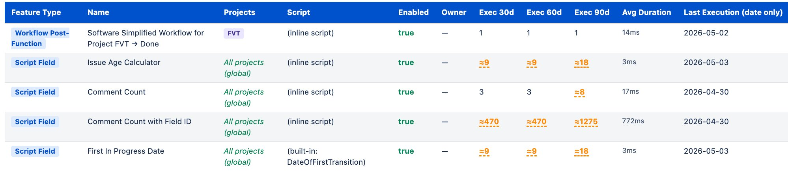

# ScriptRunner Execution Insights

> A proof of concept showing how to surface ScriptRunner execution data
> programmatically on Jira Data Center.

---

## What is this?

ScriptRunner records execution data for every script it runs — listeners,
scheduled jobs, post-functions, script fields, REST endpoints, JQL functions
— into **RRD (Round Robin Database)** files on disk. These are the same files
that power the **Performance tab** graphs in the SR admin UI, and they retain
up to two years of history.

This repository shows you how to read that data from a Groovy script running
in the ScriptRunner Script Console. The goal is to demonstrate that the data
exists and is accessible. What you build on top of it is up to you.

This is a starting point, not a finished product.** However, if you wish to
see what a full implementation *could* look like, please check
[`advanced/execution-insights-advanced.groovy`](advanced/execution-insights-advanced.groovy)
and the image below:

---

## Prerequisites

- Jira Data Center with ScriptRunner installed
- Access to the ScriptRunner **Script Console**

---

## Quick Start

### Step 1 — Find your node name

Every Jira Data Center node writes its RRD files to a separate directory.
You need to know your node name before running any script.

Run this one-liner in the Script Console:

```groovy
import com.atlassian.jira.component.ComponentAccessor
import com.atlassian.jira.config.util.JiraHome
def home = ComponentAccessor.getComponent(JiraHome).home
new File(home, "scriptrunner/rrd").listFiles()?.each { println it.name }
```

The output will be one or more directory names, for example:

```
/var/atlassian/application-data/jira/shared-home/scriptrunner/rrd/dc-saunders-0
```

Where `dc-saunders-0` is your `NODE_ID`.

---

### Step 2 — Run the discovery script

Run [`scripts/discover-ids.groovy`](scripts/discover-ids.groovy) in the
Script Console. Set your node name at the top first:

```groovy
String NODE_ID = "dc-saunders-0"   // ← change this to your node name
```

The discovery script produces an HTML report covering every ScriptRunner
feature type on your instance:

| Feature Type | What it shows | Auto-discovered? |
|---|---|---|
| Scheduled Jobs | UUID + name + owner | ✅ Yes |
| Escalation Services | UUID + name + owner | ✅ Yes |
| Script Fields | `fieldConfigurationSchemeId` + field name | ✅ Yes |
| Workflow Post-Functions | UUID + workflow + transition | ✅ Yes |
| REST Endpoints | `METHOD-name` key | ✅ Yes (if called at least once) |
| JQL Functions | Function name | ✅ Yes (if called at least once) |
| Script Fragments | Name + enabled status | ✅ Yes (inventory only — not tracked) |
| Behaviours | Name + enabled status | ✅ Yes (inventory only — not tracked) |
| Script Listeners | Step-by-step instructions | ⚠ No — see below |

Each card in the report shows a **SCRIPT_ID** value and an **RRD ✓** badge
if an RRD file already exists for that script on your node.

#### A note on Script Listeners

ScriptRunner does not expose a public API to list listener UUIDs, so they
cannot be auto-discovered. The discovery script explains this clearly and
tells you exactly what to do:

1. Go to SR admin → Listeners
2. Click **Edit** next to a listener
3. Copy the UUID from the browser URL:
   ```
   .../scriptrunner/admin/listeners/edit/dae8a1ee-f9fa-4300-af7a-f836597c9c2f
   ```
   The UUID is the last segment — `dae8a1ee-f9fa-4300-af7a-f836597c9c2f`
4. Use that UUID as the `SCRIPT_ID` in the usage report

The execution data for that listener is already on disk — you are just
telling the script where to look.

---

### Step 3 — Run the usage report

Copy the **SCRIPT_ID** from the discovery report for the script you want to
inspect. Open [`scripts/usage-report.groovy`](scripts/usage-report.groovy)
and set the two values at the top:

```groovy
String SCRIPT_ID = "paste-your-id-here"   // ← from Step 2
String NODE_ID   = "dc-saunders-0"        // ← your node name
```

Run it in the Script Console. The report automatically identifies the script
and shows its name and feature type alongside the execution metrics.

**Identity section** (shown at the top):

| Field | Description |
|---|---|
| Feature Type | e.g. Scheduled Job, Script Field, REST Endpoint |
| Name | The script's display name, looked up automatically from the ID |
| Details | Owner, HTTP method, workflow name — depends on feature type |
| Script ID | The ID you provided |
| RRD file | The full path to the RRD file on disk |

**Metrics section**:

| Metric | Description |
|---|---|
| Executions — last 30 days | How many times the script ran in the past 30 days |
| Executions — last 60 days | How many times the script ran in the past 60 days |
| Executions — last 90 days | How many times the script ran in the past 90 days |
| Avg duration | Mean execution time in ms over the 90-day window |
| Last execution | Date of the most recent recorded execution |

> **Script Listeners:** if the UUID belongs to a listener, the report will
> show "Script Listener (unconfirmed)" — SR does not expose listener names
> via a public API so the name cannot be looked up automatically. The
> execution data will still be correct.

---

### Step 4 — Multi-node clusters (optional)

If your Jira instance runs on multiple nodes, use
[`scripts/usage-report-multi-node.groovy`](scripts/usage-report-multi-node.groovy)
instead. It discovers all node directories automatically, sums counts across
every node, and shows which nodes had data for that script. Just set
`SCRIPT_ID` and run — no node name needed.

---

## Repository Structure

```
scriptrunner-execution-insights/
│
├── README.md                           ← you are here
│
├── scripts/
│   ├── discover-ids.groovy            ← run first: discovers RRD keys
│   │                                     for every SR feature type
│   │
│   ├── usage-report.groovy            ← single-node usage report for
│   │                                     one script ID
│   │
│   └── usage-report-multi-node.groovy ← same report, sums across all
│                                         nodes automatically
│
├── advanced/
│   └── execution-insights-advanced.groovy  ← see below
│
└── docs/
    └── field-guide.md                 ← deep dive: how RRD works, how
                                          to find IDs for every feature
                                          type, output explained
```

---

## How it works

ScriptRunner writes one `.rrd4j` file per script under:

```
$JIRA_HOME/scriptrunner/rrd/{nodeId}/{scriptId}.rrd4j
```

Each file contains two archives:

| Archive | Resolution | Used by |
|---|---|---|
| 5-minute | Immediate, short window | SR admin Performance tab |
| Daily | Consolidated, up to ~2 years | These scripts |

The scripts read the **daily archive** using `ConsolFun.AVERAGE` from the
`org.rrd4j` library, which is bundled with ScriptRunner. RRD timestamps are
in **epoch seconds** — the scripts multiply by 1000 when converting to dates.

The RRD key (filename without `.rrd4j`) varies by feature type:

| Feature Type | RRD Key Format |
|---|---|
| Scheduled Job | UUID |
| Escalation Service | UUID |
| Script Listener | UUID |
| Workflow Post-Function | UUID (`FIELD_FUNCTION_ID`) |
| Script Field | `fieldConfigurationSchemeId` ⚠ not the Jira custom field ID |
| REST Endpoint | `{METHOD}-{name}` e.g. `GET-myEndpoint` |
| JQL Function | the function name itself |

---

## Limitations

**Counts are approximate for high-frequency scripts.**
RRD stores the *average* executions per 5-minute window. The displayed
total is the sum of those averages — reliable as a relative indicator,
not an exact count. High-frequency scripts (script fields, busy listeners)
will show a `~` prefix.

**Counts may lag after a recent execution.**
The daily archive consolidates from the 5-minute archive periodically.
A script that ran minutes ago may still show 0. Use the SR admin
Performance tab for real-time confirmation.

**Listener IDs must be found manually.**
SR does not expose an API to list listener UUIDs. Go to SR admin →
Listeners, click Edit next to each listener, and copy the UUID from the
browser URL. See Step 2 above for the full instructions.

**Behaviours and Script Fragments are not tracked.**
SR does not write RRD files for these feature types. They appear in the
discovery script for inventory purposes only.

**REST Endpoints and JQL Functions only appear after their first call.**
SR creates the RRD file on first invocation. Scripts that have never run
will not appear in the discovery report.

---

## Going further

The scripts in this repo are intentionally minimal. Once you are comfortable
with how the data is read, natural next steps include:

- Loop over multiple script IDs to build a full inventory report
- Add a Confluence page that updates nightly via a scheduled job
- Alert via Slack or email when a script stops running
- Compare execution counts before and after a Jira upgrade

See the [Field Guide](docs/field-guide.md) for a deeper explanation of
every concept used here.

---

## What a full implementation looks like

The simple scripts above cover one script ID at a time. To show how far this
approach can be taken, the `advanced/` folder contains a more complete example
built on the same foundations.

[`advanced/execution-insights-advanced.groovy`](advanced/execution-insights-advanced.groovy)
covers every ScriptRunner feature type in a single run and adds:

- Automatic inventory of all feature types — Scheduled Jobs, Escalation
  Services, Script Listeners, Workflow Post-Functions, Script Fields, REST
  Endpoints, JQL Functions, Script Fragments, and Behaviours
- Fallback data sources (database and in-memory) when no RRD file exists
- Script Field RRD key resolution via the `customfields` property
- Broken trigger detection via live Quartz scheduler data
- Multi-node cluster support
- Orphaned script detection from database records
- A styled HTML report with inline documentation and known limitations

**This advanced script is provided as-is, for reference only.**
It is not maintained, not supported, and not intended to be used in
production. It exists to show what is possible when you build on top of
the primitives demonstrated in the simple scripts — nothing more.

If you want to build something like it, start with the simple scripts
and add what you need.
